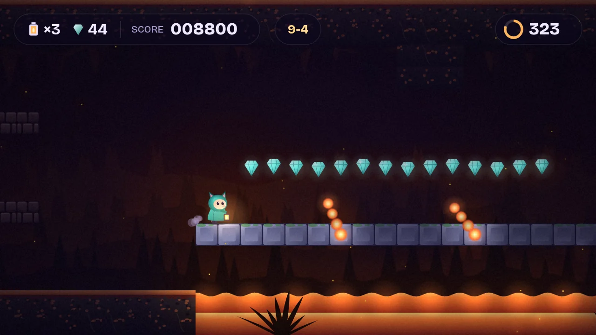
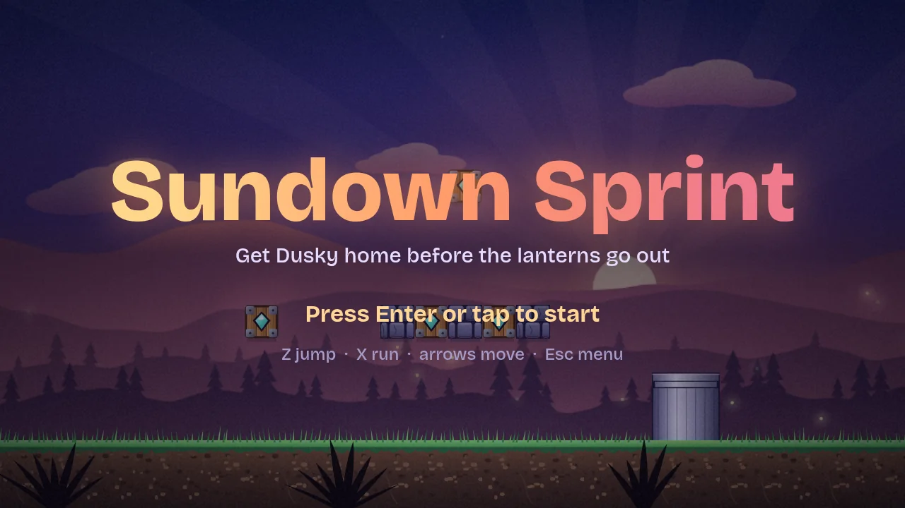
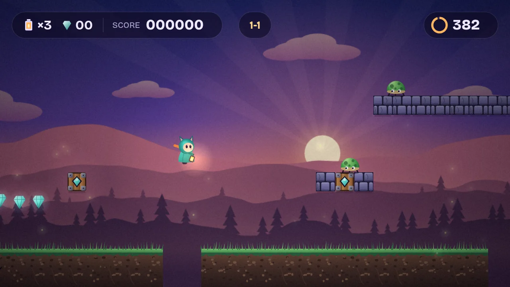
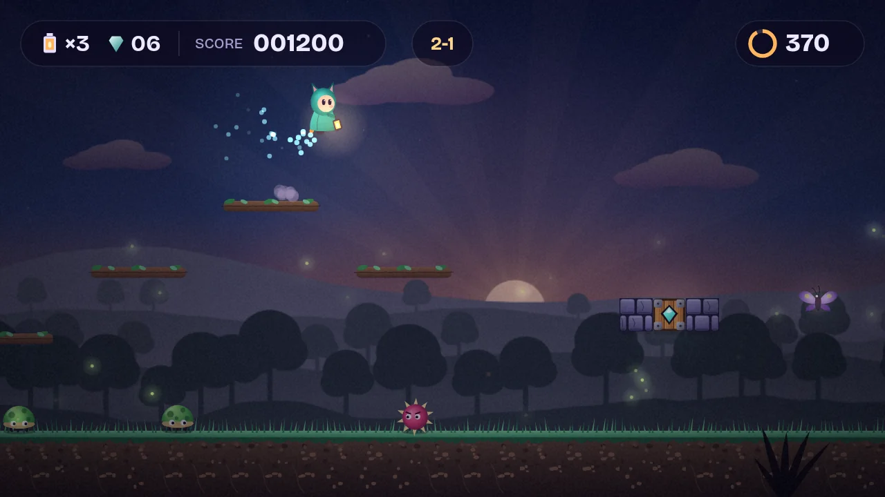
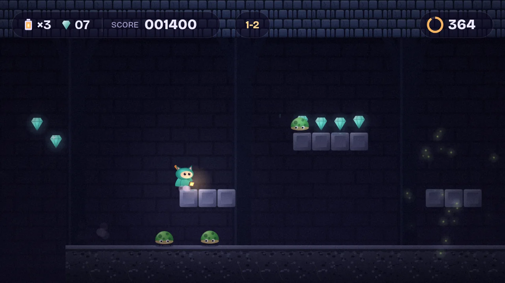
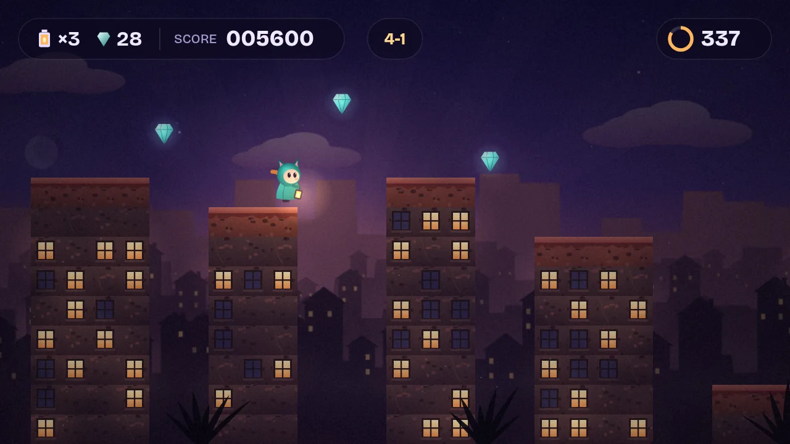
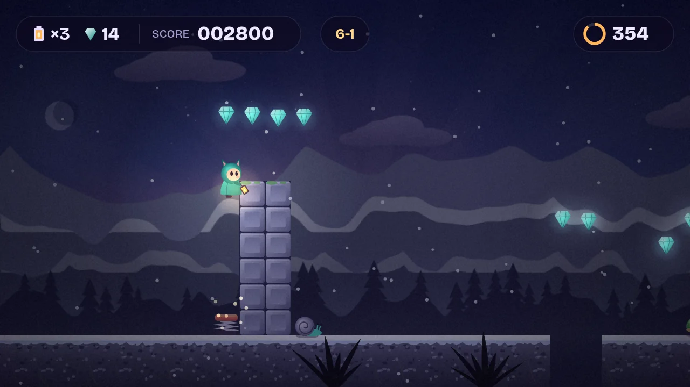
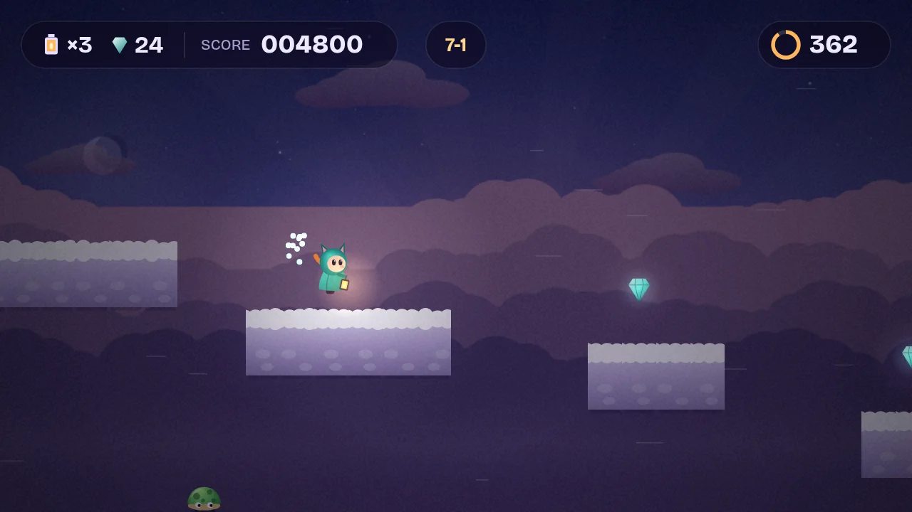
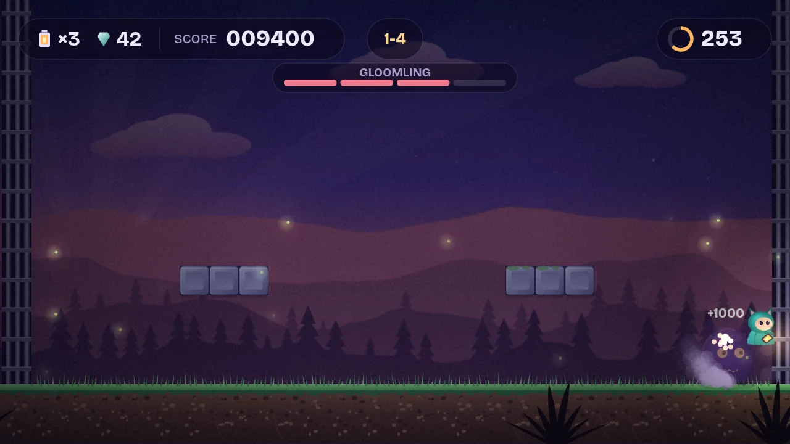
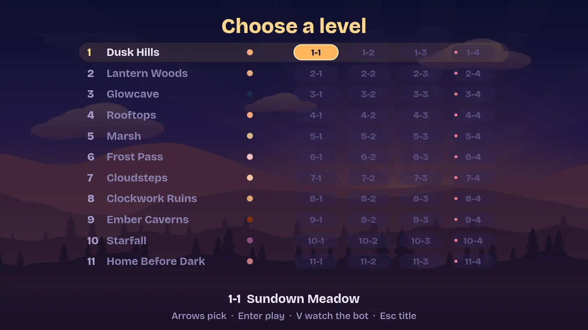

# Sundown Sprint

Dusky carries a lantern home as the sun goes down. A browser platformer across 11 worlds of 4 levels each: every x-2 dives underground through a cellar door, and every x-4 is a fire fortress with a Gloomling boss at the end. Frame-exact NES-style movement physics, real-time lantern lighting, and art and music that are entirely procedural. No image or audio files.

**▶ Play:** https://www.kapilsharma.dev/sundown-sprint/ (published from `main` via GitHub Pages). Press `F` for full screen.



| | |
|---|---|
|  |  |
| **Title.** | **1-1 Sundown Meadow**, the original Duskrunner level. |
|  |  |
| **Lantern Woods.** Branch ledges and duskmoths. | **Underground.** Every x-2 goes below through a cellar door. |
|  |  |
| **Rooftops.** Washing lines, attics and bell towers. | **Frost Pass.** Ice, springs and pebblesnails. |
|  |  |
| **Cloudsteps.** Islands over nothing, with wind. | **Bosses.** A second phase at half health. |



## Features

- 44 levels in 11 themed worlds: Dusk Hills, Lantern Woods, Glowcave, Rooftops, Marsh, Frost Pass, Cloudsteps, Clockwork Ruins, Ember Caverns, Starfall and Home Before Dark.
- Swimming, ice, conveyors, springs, moving and falling platforms, wind, meteors, kickable shells, fire wheels, fire jets, lava, checkpoints.
- A deterministic 60 Hz sim with integer SMB1 physics. Optional modern assists (coyote time, jump buffer) or strict 1985 rules.
- Keyboard, gamepad and touch. Full screen. Progress saved in the browser.
- Watch mode: a bot plays any level for you. Every level is proven beatable by that same bot.
- Renders at up to 1200p. On slow devices it lowers grain and resolution to hold the frame rate.

## Development

```sh
npm run dev      # play at http://localhost:8080  (test mode: /?test, one level: /?level=2-3, watch the bot: /?watch=1-1)
npm test         # physics golden traces, level structure, and every recorded bot run
npm run solve    # bot plays every level to prove it can be finished
npm run levels   # regenerate levels/*.json from tools/
```

No dependencies. Needs Node 20+ for the tools; the game itself is static files. See `CLAUDE.md` for the architecture.

CI (`.github/workflows/ci.yml`) runs the tests and checks the level JSON matches its generators on every push. `Solve levels` is a manual workflow that runs the bot over all 44 levels, one world per job.
